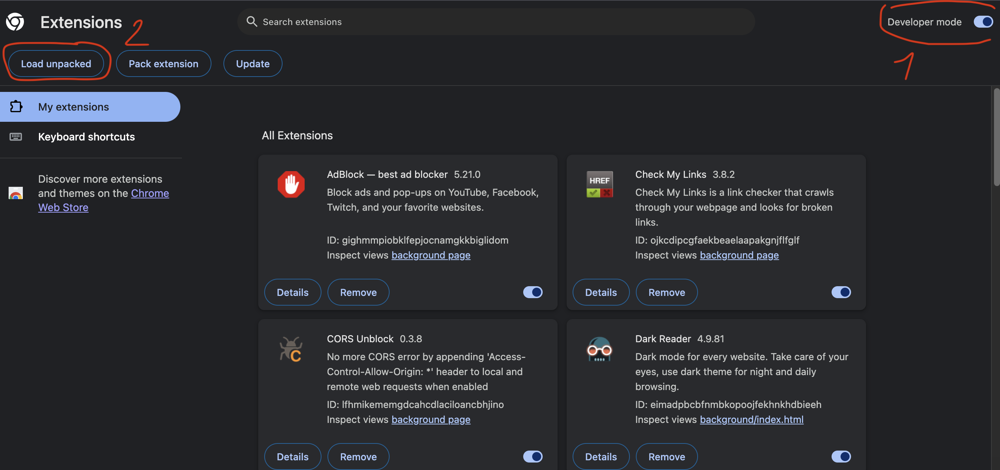
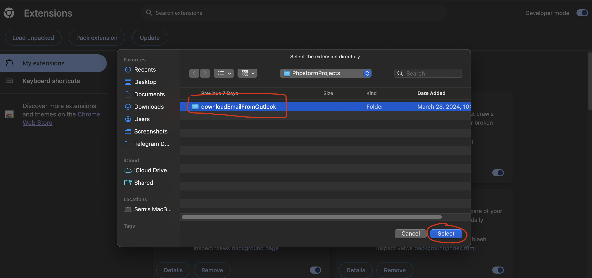
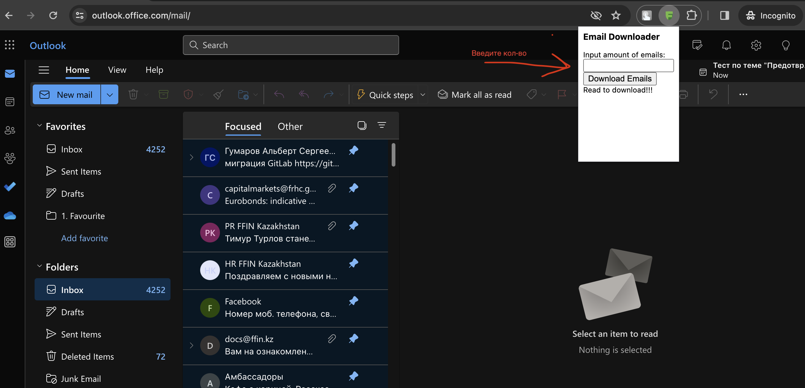
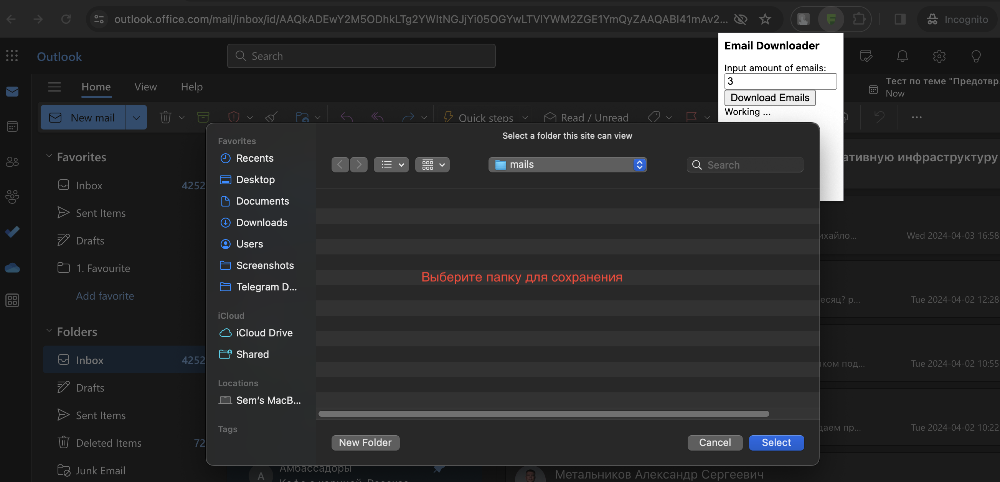

## Установка расширения (пример)

### Необходимо доделать
1) Загрузка файлов которые грузятся из фрейма в данном случае (Word,Excel)
2) Многоуровневые письма

### Оптимально к реализации
1) Интерфейс расширения